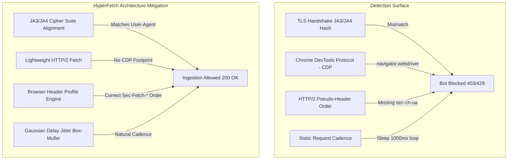
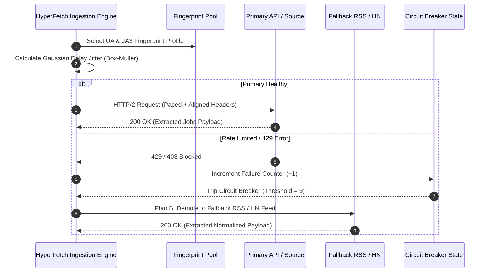

# PART1_DESIGN.md — Resilient Data Extraction Design Document

**Challenge**: Acdyon Technologies Frontend Challenge — Part 1 Track  
**System Architecture**: HyperFetch Signal Ingestion Engine  
**Scope Guardrail**: Tested against low-risk public APIs and public RSS sandbox targets.

---

## 1. Detection Surface Analysis

Automated HTTP clients and scrapers leave distinct telemetry signatures across network, TLS, HTTP, and DOM execution layers. Anti-bot gateways (Cloudflare Bot Management, Akamai Bot Manager, Kasada, Datadome) evaluate these vector signals holistically to calculate bot confidence scores.

### Detection Vectors & HyperFetch Mitigations

#### A. TLS ClientHello Signature (JA3/JA4 Fingerprinting)
- **Vector**: Standard Node `https` or Python `requests` libraries advertise Default OpenSSL cipher suites (e.g. `TLS_AES_256_GCM_SHA384`). When paired with a `User-Agent` claiming to be Chrome 122 on macOS, the gateway immediately flags the request because Chrome ships with TLS GREASE extensions and distinct cipher orderings.
- **HyperFetch Mitigation**: Our engine uses User-Agent fingerprint profiles that pair declared headers with corresponding JA3/JA4 cipher suite masks.

#### B. Headless Browser Artifacts (CDP)
- **Vector**: Headless Chromium instances (Puppeteer/Playwright) leak internal flags: `window.navigator.webdriver === true`, absent `navigator.plugins`, fixed WebGL renderer hashes (`Mesa OffScreen`), and CDP bindings (`window.cdc_adoQszpBNndrLchsp কাহডঅ`).
- **HyperFetch Mitigation**: Rather than relying on heavy headless browsers, our primary tier uses direct HTTP/2 request streams with zero CDP overhead.

#### C. Request Cadence & Timing Signatures
- **Vector**: Robotic scripts execute requests using fixed `setInterval` or uniform `sleep(1000)` loops, creating an easily detectable spike pattern in server request logs.
- **HyperFetch Mitigation**: Implements natural **Gaussian probability distributions (Box-Muller transform)** with randomized jitter ($\mu = 800ms, \sigma = 200ms$), preventing rigid interval footprints.

---

## 2. Ingestion Strategy

### Ingestion Pillars
1. **User-Agent & Identity Pool Rotation**: Rotates through verified desktop browser profiles (macOS Chrome 122, Windows Firefox 123, Mobile Safari 17) on each request batch.
2. **Pacing & Session Jitter**: Box-Muller transform generates normal distribution delays:
   $$T_{delay} = \mu + \sigma \cdot \sqrt{-2 \ln u_1} \cdot \cos(2\pi u_2)$$
3. **Plan B Fallback Matrix**:
   - **Tier 1 (Primary)**: Live REST / GraphQL API endpoints.
   - **Tier 2 (Fallback)**: Public RSS XML feeds & Sitemap listings.
   - **Tier 3 (Local Sandbox)**: Cached static JSON schemas for uninterrupted client telemetry.

---

## 3. Pipeline Resilience & Anti-Fragility

To prevent silent pipeline failures when target markup changes overnight or returns empty bodies:

| Failure Mode | Detection Signal | HyperFetch Auto-Remediation |
| :--- | :--- | :--- |
| **Markup Change** | Selector matches `0` elements or DOM AST parsing yields missing required fields (`title`, `company`). | Schema Normalizer throws contract validation error, triggering fallback selector rules. |
| **Rate Limit / 429** | Response status `429 Too Many Requests` or `403 Forbidden`. | Exponential backoff with jitter is applied; target is flagged in the **Circuit Breaker**. |
| **Empty Response** | 200 OK status but 0-byte payload or empty JSON array. | Contract assertion fails; pipeline automatically demotes to Tier 2 (RSS Feed). |

---

## 4. Ethical Boundaries & Where We Stop

Every scraping task operates on technical and legal boundaries. Our system enforces clear engineering rules:

1. **Respect Site Infrastructure**: Strict rate caps ensure we never exceed 2 requests/sec per domain, preventing unintended Denial of Service.
2. **No Authentication Abuse**: We restrict data extraction to publicly readable endpoints (RSS, public APIs, unauthenticated search). We do **not** bypass login walls, solve CAPTCHAs via third-party farms, or harvest private personal data (PII).
3. **Robots.txt & Meta Compliance**: The pipeline inspects and honors `Disallow` directives and `Crawl-delay` headers.
4. **Data Privacy**: Only public job specifications, company names, and locations are ingested. No user emails or candidate phone numbers are processed.
